# telegram downloader (beta) 


**telegram downloader is a program to download files from channels that prevent the forwarding of messages to a bot, allowing the download of files using the personal account via the web UI and command line**

## docker
```
docker run --rm -it \
    -e APP_ID=xxxxxxxx \
    -e API_HASH=xxxxxxxxxxxxxxxxxxxx \
    -e BOT_TOKEN=xxxxxxxxxxxxx:xxxxxxxxxxxxxxxx \
    -p6543:5000 \
    -v /mnt/user/appdata/telegram-test:/config  \
    jsavargas/telegram-downloader-ui:beta 

    docker run --rm -it -e APP_ID=123456 -e API_HASH=12345678901234567890 -e BOT_TOKEN=1234567890:abcdefghijklmabcdefghijklm-p4 -p6543:5000 -v /mnt/user/appdata/telegram-test:/config  jsavargas/telegram-downloader-ui:beta

```

## docker-compose
```
version: "3.9"
services:
  telegram-downloader:
    image: jsavargas/telegram-downloader:alfa
    container_name: telegram-download
    environment:
      - PUID=99
      - PGID=100
      - APP_ID=131 
      - API_HASH=3efad
      - BOT_TOKEN=3945:Pd09m-p9
      - TZ=America/Santiago
    volumes:
      - ./config:/config
      - /mnt/user/download/torrent/telegram/bot:/download
    ports:
      - 7676:5000
```

## Use 

### Configs (Envs)
- `BOT_TOKEN` - Get it by contacting to [BotFather](https://t.me/botfather)
- `APP_ID` - Get it by creating app on [my.telegram.org](https://my.telegram.org/apps)
- `API_HASH` - Get it by creating app on [my.telegram.org](https://my.telegram.org/apps)

- `OWNER` - Your nickname telegram
- `TZ`- America/Santiago

### Use docker-compose
```sh 
docker-compose up -d

http://IP:5555
```

### How to use step by step 


#### First: enter the container
```bash
docker exec -it telegram-downloader sh
```

#### Second: create telegram credentials for use
```bash
Create Credenciales
docker exec -it telegram-download python create_config.py 
```


### CLI usage
```
docker exec -it telegram-download python telegram.cli.py -h
docker exec -it telegram-download python telegram.cli.py --help 

docker exec -it telegram-download python telegram.cli.py -g traicionada_mega 
docker exec -it telegram-download python telegram.cli.py -g traicionada_mega -d
```


### UI usage

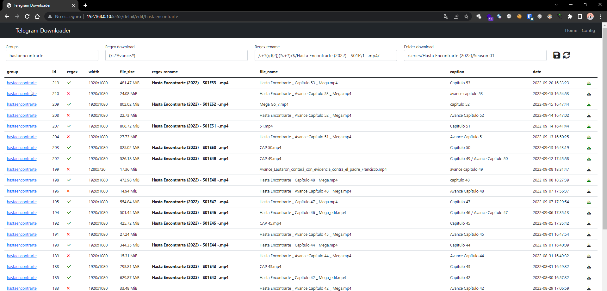

### Config
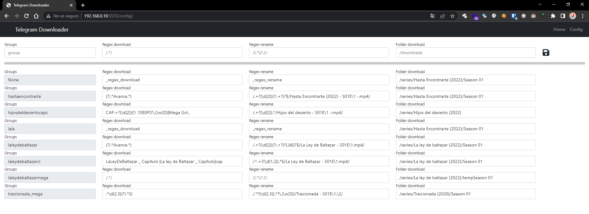

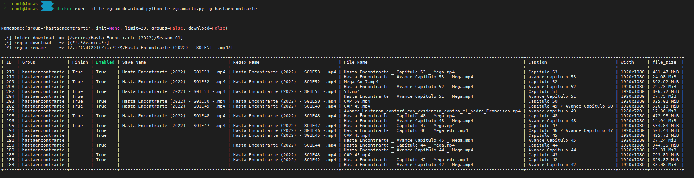

## Step by Step

1. Create config
```
docker exec -it telegram-download python create_config.py 
``` 
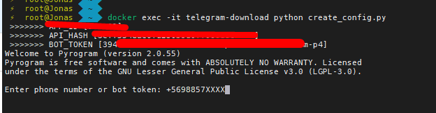

2. Enter http://IP:Port

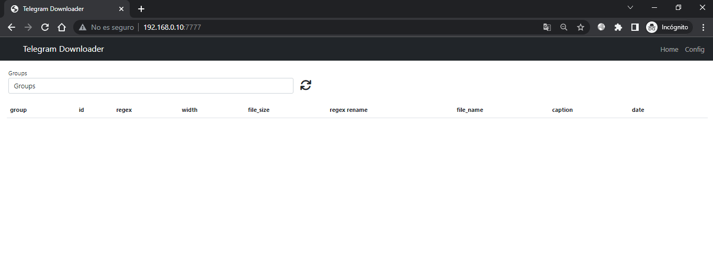

3. Enter http://IP:Port/config

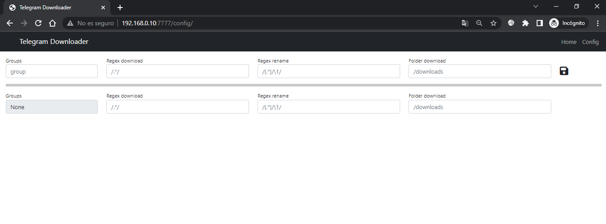

4. Add Group Name download files

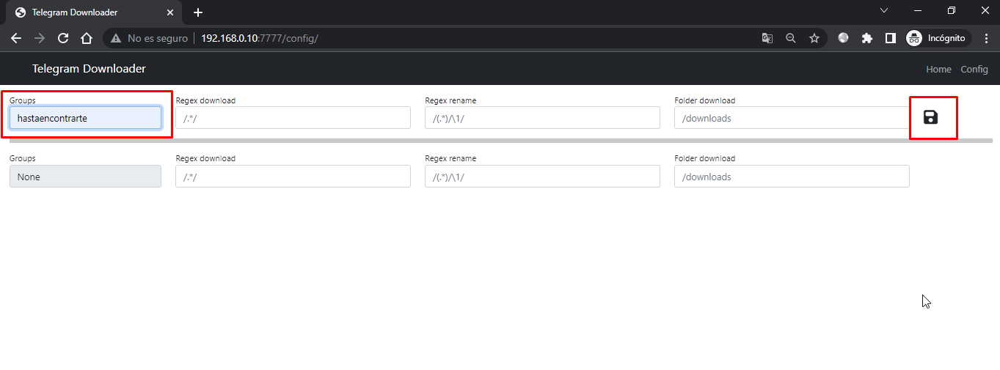

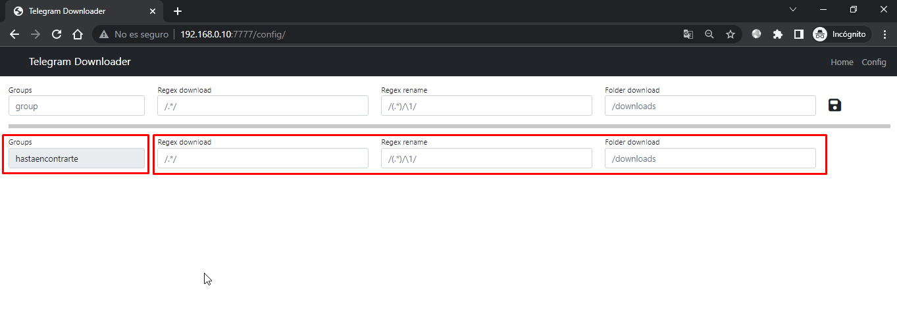

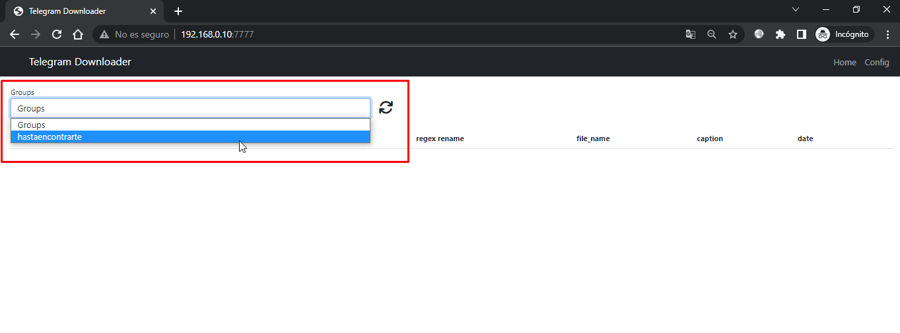

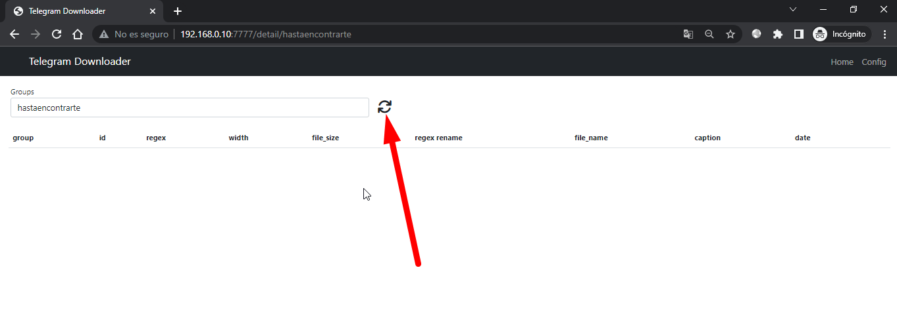

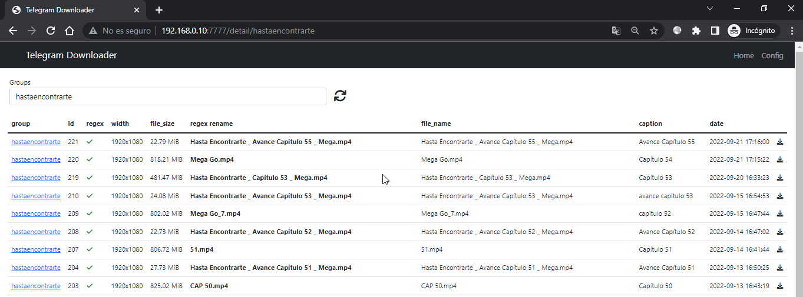

5. Add "Regex download", "Regex rename" and "Folder download"

- **Regex download:** regex to enable files to be downloaded (empty, enable all)
- **Regex rename:** file renaming regex (empty, do not rename anything)
- **Folder download:** folder where the files will be downloaded (vacia, descarga en la carpeta por default "/download")

Click here to edit the regular expression options and the folder where the files will be downloaded

### Example:
**Regex download:** "Regex download"
>NOTE: regex to enable files to be downloaded (empty, enable all)

**Regex rename:** "/.*(\d{2}).*/new_name_\1.mp4/"
>NOTE: file renaming regex (empty, do not rename anything)

>NOTE: **Part one:** /.*(\d{2}).*/

>NOTE: **Second Part:** /new_name_\1.mp4/


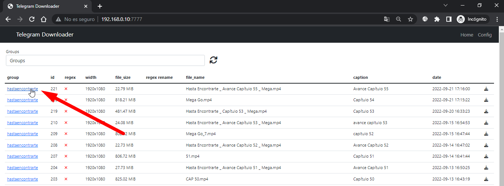

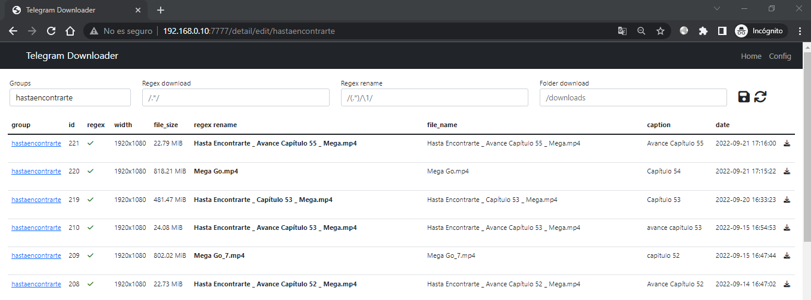

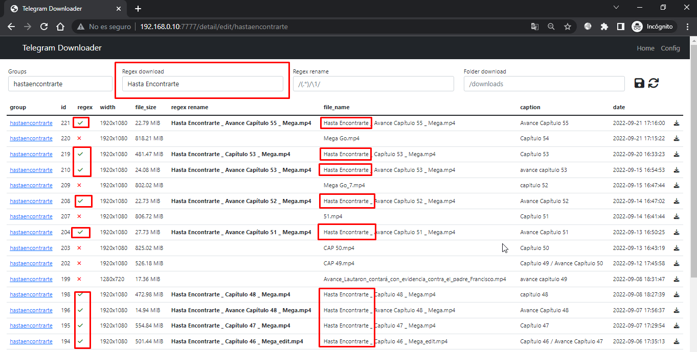

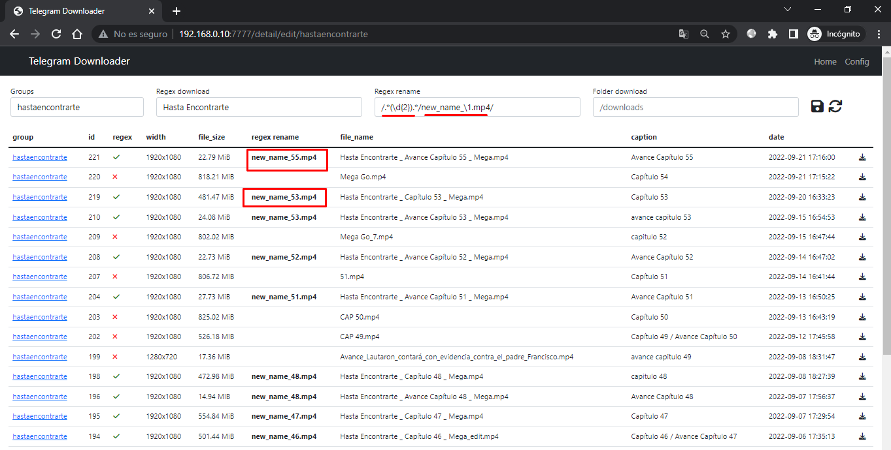

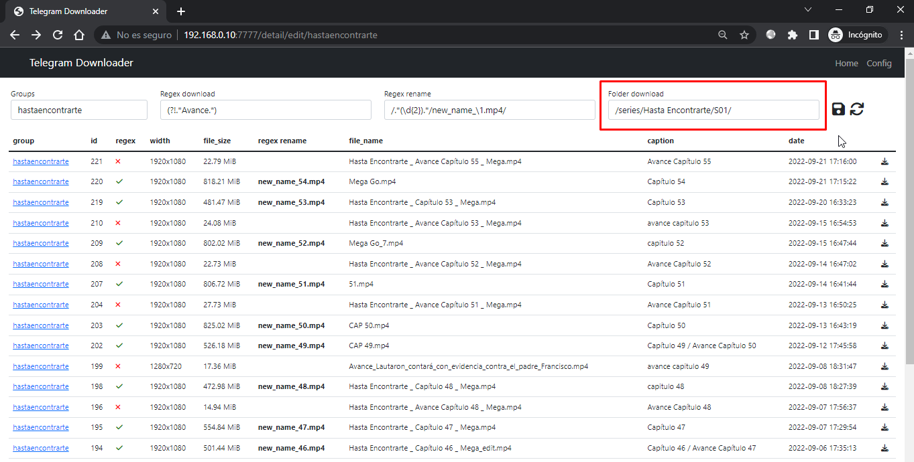

Download one at a time, one by one

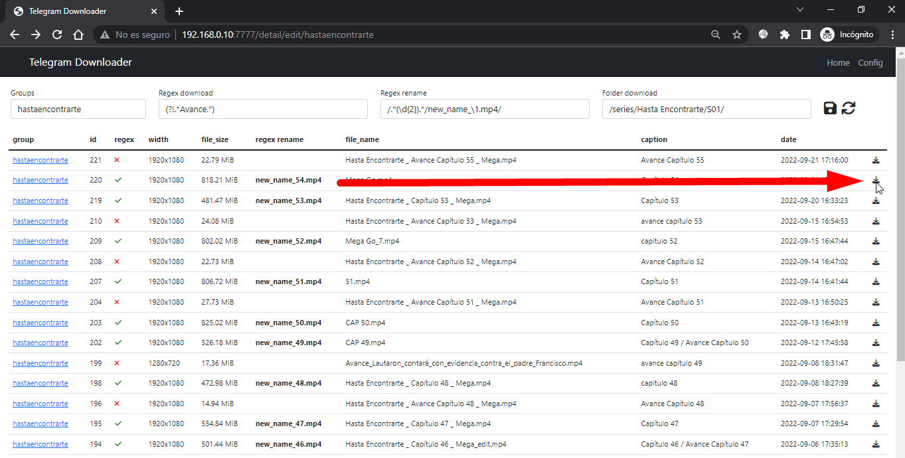

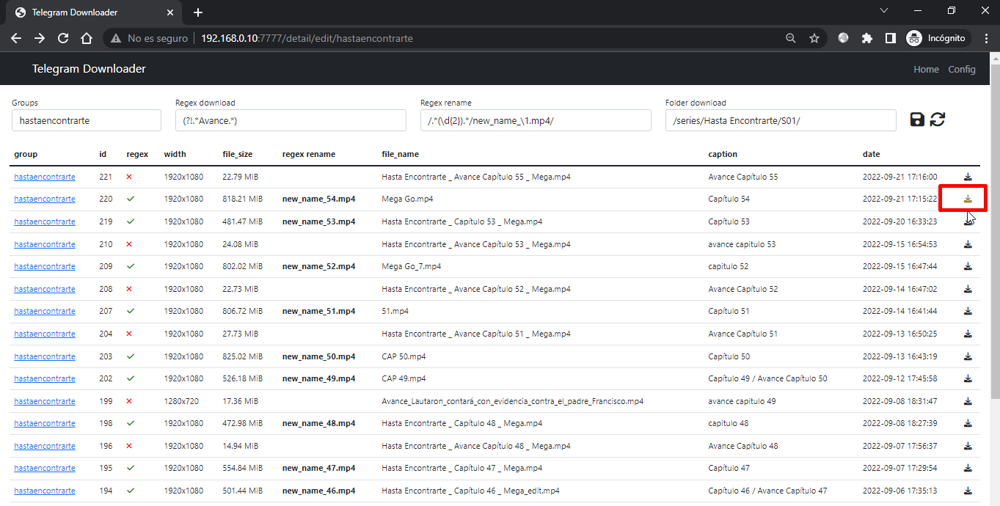

The arrow turns green when the download is complete

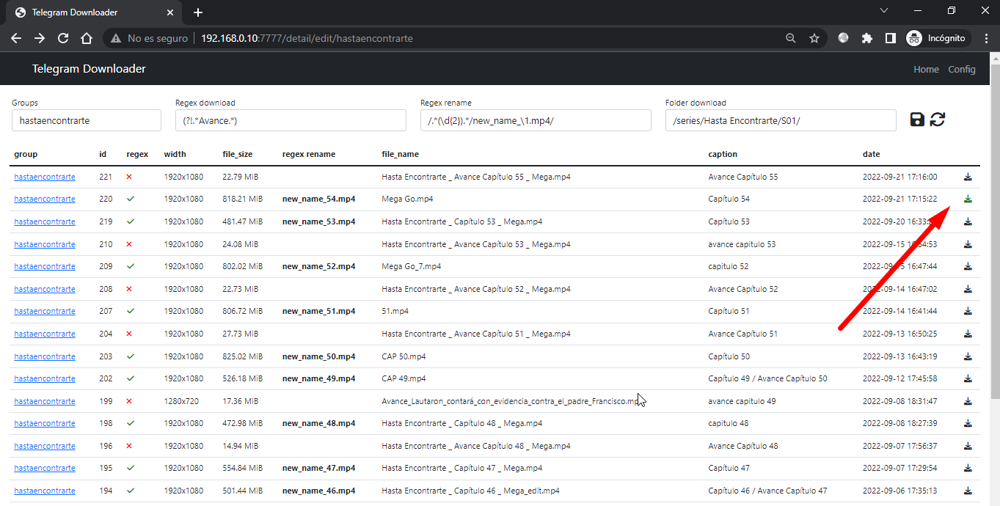


### Another example

Disable downloading of files containing the word "avance"

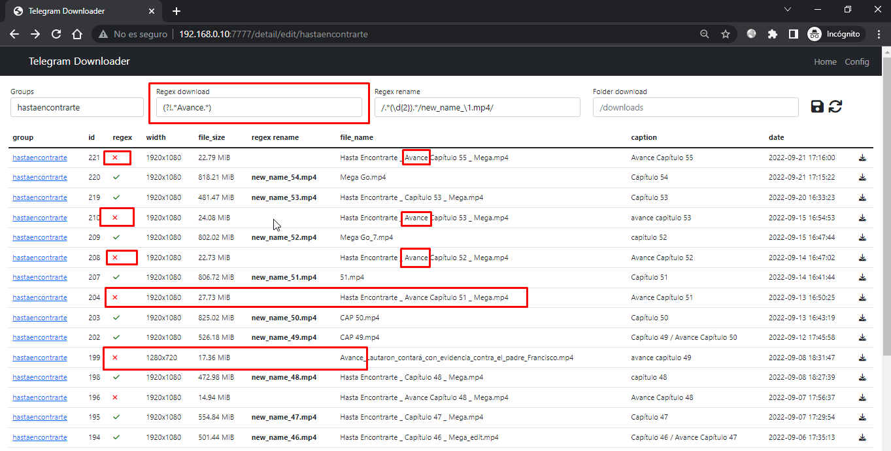

## Downloads by terminal

```
docker exec -it telegram-download python telegram.cli.py -h
docker exec -it telegram-download python telegram.cli.py -g hastaencontrarte
docker exec -it telegram-download python telegram.cli.py -g hastaencontrarte -d
```

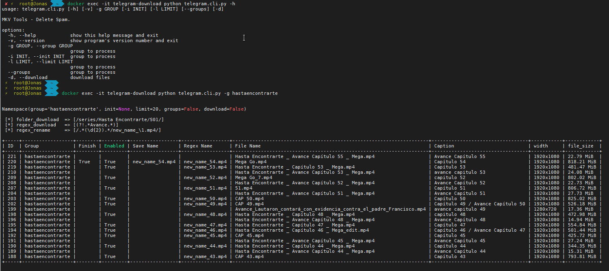

